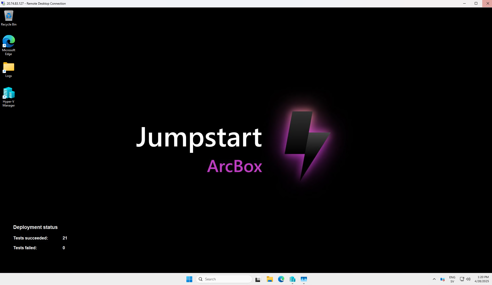

# Intro Arc & Azure Jumpstart

Det finns en miljö redan förprovisonerad i Azure som vi kan använda för att snabbt komma igång med Azure Arc. Denna miljö är byggd med hjälp av [Azure Jumpstart](https://jumpstart.azure.com/) och är en bra startpunkt för att lära sig mer om Azure Arc och dess kapabiliteter. Vi kommer att använda denna som bas. I korthet är det byggt på en Azure Virtual Machine, där Hyper-V är installerat och 5 VNs (2 Windows, 2 Linux och 1 SQL) är Arc enabled

Mer om Jumpstart projektet finns här
- [Azure Jumpstart](https://jumpstart.azure.com/)

## Verifiera access och miljö - Azure 
I dessa steg ska vi verifera att vi har access till labbmiljön och att vi har efoderliga rättigheter.

 - Logga in i Azure portalen [Azure Jumpstart](https://portal.azure.com/) med din arbetsidentitet.
 - Verifiera att du har access till Azure Jumpstart miljön. Du ska kunna se en resursgrupp som heter `arcbox` eller liknade med ditt namn i Azure subscription. Om du inte ser den, kontakta din workshopledare.
    - Verifiera att du har tillräckliga rättigheter genom att gå till Access Control (IAM) i resursgruppen och verifiera att du har rollen `Owner` eller `Contributor` på resursgruppen.
 - I Overview fliken i resursgruppen, att Tags `DeploymentStatus: Tests succeeded: 21 Tests failed: 0` samt `DeploymentProgress : Completed`

 ## Verifiera access och miljö - Klient Maskin
 Vidare ska vi verifiera att vi har access att komma åt vår Hyper-V miljö.

 - Navigera till er resursgrupp i Azure Portalen och gå in på ArcBox-Client
 - Välj Connect och välj sedan Just in time (JIT)
    - För en första gång kommer de konfiureras och sedan kommer du få begära access
 - Kör antingen RDP via RDP client eller via Azure portalen och logga in med de credentials som blivit tillhandahållna.

Om allt är som de ska ska ni se följande

## Navigera Arc i Azure portalen

Det finns flera sätt att använda resurser i Azure och var man kan access dem. Via portalen kan man i sök fönstret gå in på "Azure Arc" - här finns samtliga Arc tjänster samlade. 

- Leta fram era maskiner - ser du flera maskiner som inte tillhör din resursgrupp? Försök att filtrera så ni enbart ser era maskiner
- Vad för information kan vi få från denna vy?

