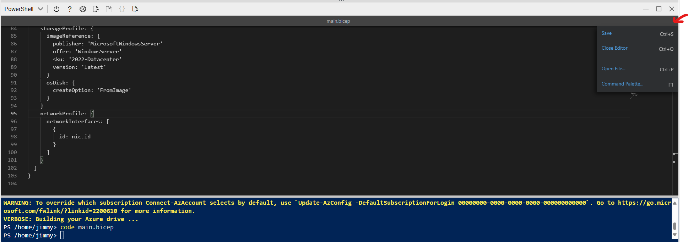
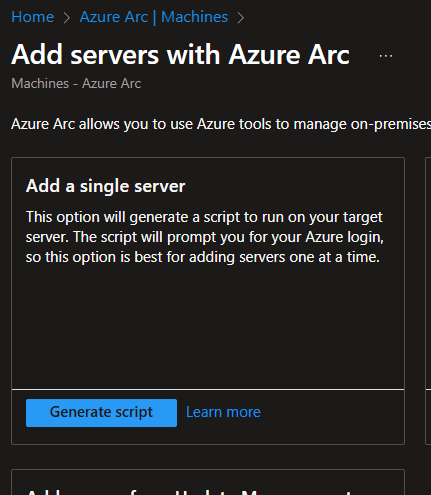
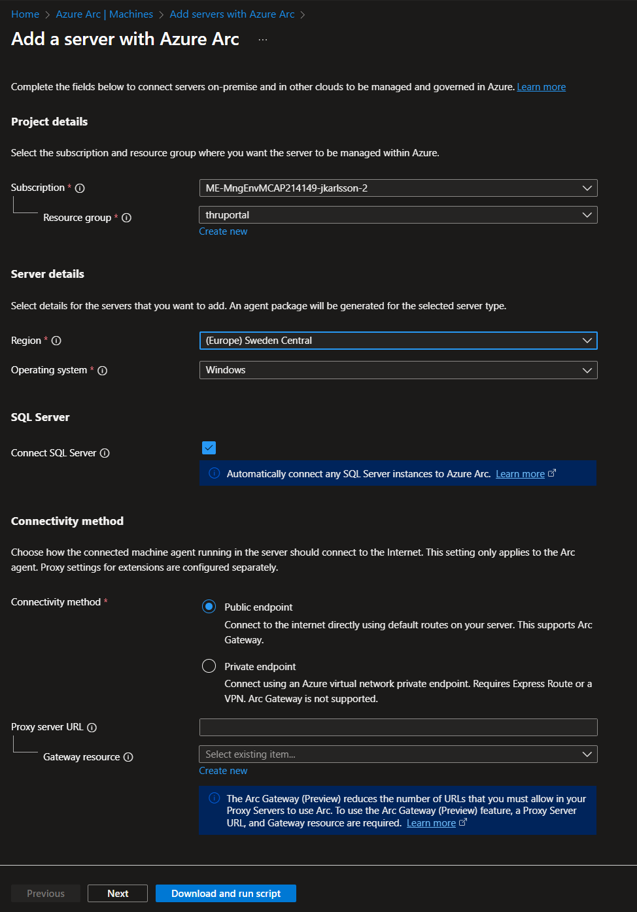
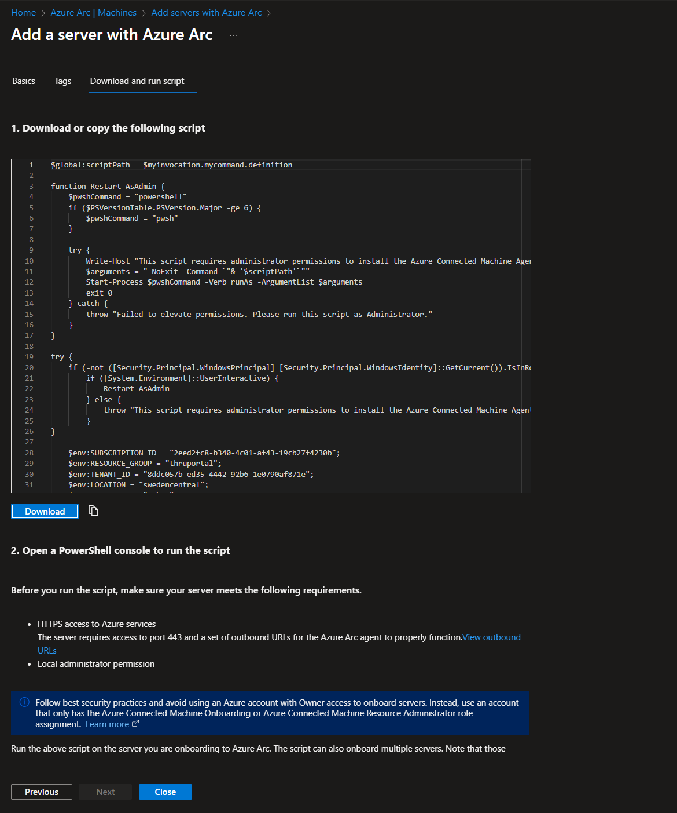
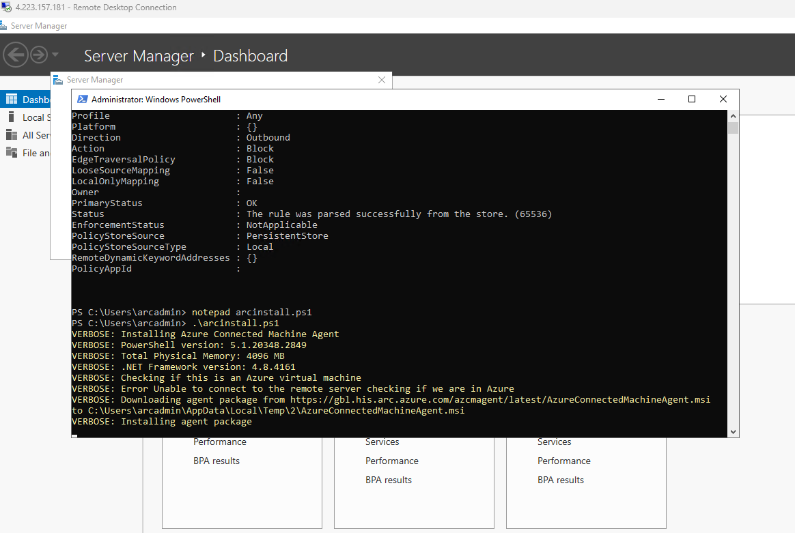

# Onboarda Azure Arc maskin (Optional)

Här får vi möjligheten att skapa en egen maskin som vi kan onboarda till Azure Arc. Detta är valfritt och ni kan hoppa över detta steg om ni inte vill onboarda en egen maskin. Fördelen med att göra detta är ni kan sedan onboarda tjänster till denna på de andra utmaningarna för att få en uppfattning av hur det fungerar.

För att göra detta kommer vi skapa en Azure VM som vi sedan kommer konvertera till en Arc enabled server. 

> [!TIP]
> Ifall man har en egen VM på Hyper-V eller liknade, går det lika bra att onboarda den till Azure Arc. Skippa ispåfall till Onboard Arc delen av instruktionen

## Skapa Azure VM
Det går att skapa en Azure VM på flera olika sätt, antingen via Azure portalen, CLI/Powershell eller Bicep exempelvis. Det finns en bicep template förbered under Scripts/Challenge2/ som vi utgår ifrån.

 - I Azure portalen - öppna upp CloudShell (välj Powershell)
 - Skapa upp en fil, kallad main.bicep `code main.bicep` (Detta öpppnar en editor i CloudShell)
 - Klistra in koden från main.bicep filen i editor fönstret och spara filen (Ctrl + S)
    - För att stänga fönstret, hovra muspekaren på högerkanten på tabben och välj close editor 
 - Nu ska vi starta bicep deploymenten, kör följande kommando, byt ut ResourceGroupName till er Resursgrupp
```powershell
New-AzResourcegroupdeployment -Name "Arcdemo" -resourceGroupName "archack-rg" -TemplateFile ./main.bicep -Verbose
```
 - Ni kommer bli promptad med lösenord. 
    - Användarnamnet är redan ifyllt i templaten, arcadmin.
 - Vänta tills deploymenten är klar, detta kan ta några minuter.

## Förbered VM för Azure Arc
Nu ska vi förbereda vår VM för Azure Arc. Per default så tillåts inte en VM skapad i Azure att onboardas till Azure Arc. Vi kommer därför behöva stänga av ett par saker och därmed "lura" Arc att det är en vanlig VM. Innan ni gör detta, kontrollera att de inte finns några VM extension på maskinen, isåfall ta bort dessa.

 - Logga in på er VM via RDP (precis som i föregående steg)
 - Öppna Powershell som administratör och kör följande kod 
 ```powershell
#Sets variable so the Arc installer will not identify the machine as an Azure VM. 
[System.Environment]::SetEnvironmentVariable("MSFT_ARC_TEST",'true', [System.EnvironmentVariableTarget]::Machine)

#Disables the Windows Azure Guest Agent service 
Set-Service WindowsAzureGuestAgent -StartupType Disabled -Verbose
Start-Sleep -Seconds 2
Stop-Service WindowsAzureGuestAgent -Force -Verbose

#Blocks access to the Azure Instance Metadata Service (IMDS) endpoint.
New-NetFirewallRule -Name BlockAzureIMDS -DisplayName "Block access to Azure IMDS" -Enabled True -Profile Any -Direction Outbound -Action Block -RemoteAddress 169.254.169.254
```

## Onboarda VM till Azure Arc

Nu är vår VM redo att onboardas till Azure Arc. 

- Gå till Azure portalen och sök på Azure Arc, Machines och välj Add/create "Add a Machine"
- Välj Add a Single Server (Generate script) 
- Välj er resurs grupp samt Region ni vill att metadatan ska ligga i (exempelvis Sweden Central), alla andra värden är default 
- Fyll i taggar om ni vill, annars Next
- Kopiera ut scriptet som genererats. Detta ska vi köra på vår VM vi har skapat. 
- Inne på maskinen, öppna Powershell som administratör och klistra in scriptet ni kopierade från portalen. Detta kommer installera Azure Arc agenten på maskinen och onboarda den till Azure Arc. 
  - Ni kommer under installation bli promptad att logga in med era Azure credentials.
- Efter installationen, gå tillbaka till Azure portalen och verifiera att ni ser er maskin under Azure Arc Machines.