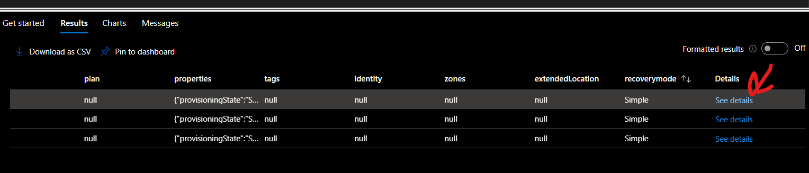
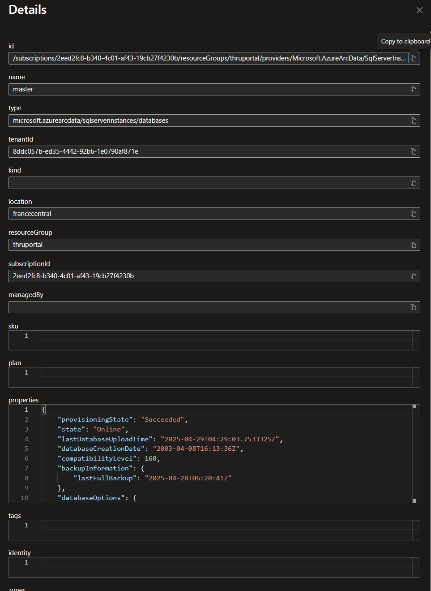
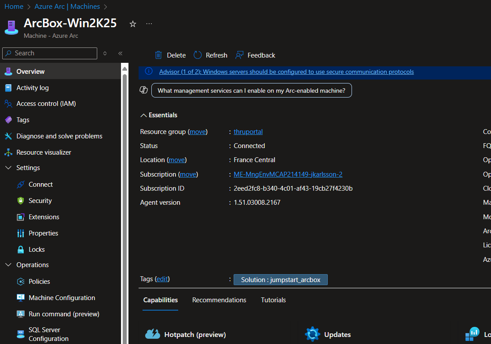

# Resource graph & Tags
I Azure är alla resurser ett objekt. Det gör att de sparas i ett schema och därmed finns de möjligheter med KQL (Kusto Query Language) att söka i dessa resurser. Det är en kraftfull funktionalitet som gör att vi kan söka i resurser på ett enkelt sätt. Vi kommer använda oss av detta för att söka i våra resurser och se vad vi har för resurser i vår miljö. Vi kommer även använda oss av tags för att kategorisera våra resurser och se hur vi kan använda dessa för att söka i våra resurser.

## Resource graph

I Azure Portalen gå till Resource Graph Explorer och kör följande query:
```kql
resources
```
Med detta får du upp alla resurser som finns (som ditt konto har tillgång till). Försök att filtrera ner till enbart resurser som är i din resursgrupp. Ifall osäker, fråga Azure CoPilot eller din workshopledare. 


### Ta reda på vad för virtuella maskiner du har och dess konfiguration
Ibland vill man få ut en samlad bild av sin estate, exempelvis vilka OS versioner kör vi och hur är dessa maskiner bestyckade
Ifall ni kör nedan följande får ni ut en lista på era virtuella maskiner och dess OS versioner. 
```kql
resources
| where type =~ 'microsoft.hybridcompute/machines'
//| where tags['manual'] =~ 'yes'
| extend cores = toint(properties.detectedProperties.logicalCoreCount)
| extend memorygb = toint(properties.detectedProperties.totalPhysicalMemoryInGigabytes)
| extend osSku = tostring(properties.osSku)
| mv-expand storage = properties.storageProfile.disks
| summarize storageGB=sum(tolong(['storage'].maxSizeInBytes))/1024/1024/1024 by name, cores, memorygb,osSku
```
Försök att filrera ner till enbart Windows maskiner.

### Ta reda på vad för databaser vi har i miljön
I vår miljö har vi en SQL server som är Arc enababled, denna har databaser på sig. Även dessa är listade som objekt. Vi kan lista dessa genom att köra följande

```kql
resources
| where type =~ 'microsoft.azurearcdata/sqlserverinstances/databases'
```
Man kan alla resurser få fram ganska många olika properites. Genom att expandera Details (See details) och under Properties kommer alla värden som finns sökbara och flera fall påverkningsbara ifall man vill




Med denna information, använd för att få fram alla databaser som inte har Full i Recovery mode Ifall osäker, fråga Azure CoPilot eller din workshopledare. 


## Taggar
Taggar är ett sätt att kategorisera resurser i Azure. Det är en nyckel-värde par som kan användas för att katogireras eller populera med Metadata som kan vara relevant för er verksamhet. Vanligt förekommande är exempelvis systemägare, kostnadsställe, typ av miljö (dev, prod) osv. Alla 

Gå in på en av era Arc maskiner i portalen, exempelvis ArcBox-Win2K25. På overview fliken har vi en tag satt, `Solution: Tjumpstart_arcbox`


- Välj edit vid tags
- Lägg till en tagg som heter 'Owner' och sätt värdet till ert namn
- Spara
- Gå tillbaka till Resource Graph Explorer och kör följande query: (byt ut KalleAnka mot ert namn)
```kql
resources
| where type =~ 'microsoft.hybridcompute/machines'
| where tags['Owner'] =~ 'KalleAnka'
```
- Vad får ni för resultat?

### Sätta taggar i skala
Det finns flera sätt att sätta taggar i skala (de vill säga på flera objekt samtidigt). Portalen, Powershell eller via Azure Policy.

Via Portalen
- Gå till Azure Arc och välj Machines
- Välj två eller flera maskiner
- Välj Assign tags
- Sätt tagg "Dag" och värde "Tisdag"


