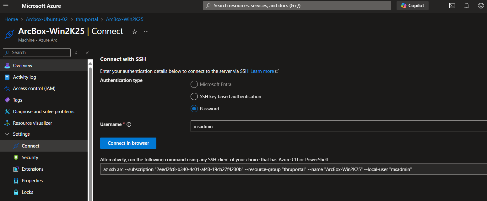

# Interact and Manager Arc enabled server
Hittils har vi mestadels sett vad vi kan se och sätta metadata (taggar) kring våra Arc Enabled servers. Nu ska vi gå igenom några funktioner där vi kan påverka maskinen och interagera med den. Vi kommer att använda Cloudshell för dessa delar, men de går att göra via templates och i vissa fall via Portalen.


## Run Command on Arc enabled server
Run command exekvererar ett kommando inne på er maskin via Arc agenten. Detta är exempelvis bra för att köra one off kommandon eller script. Låt oss försöka skapa en text fil inne på maskinerna

- Inne i Azure Portalen, öppna upp Cloudshell (välj Powershell)
- Kör följande kommando på en av Windows maskinerna (byt ut namnet på maskinen till er maskin samt resursgrupp)
    - Ifall ni kör på Ubuntu maskinerna är det de adra kodstycket
```powershell
New-AzConnectedMachineRunCommand -ResourceGroupName "thruportal" -MachineName "ArcBox-Win2K25" -Location "fraceCentral" -RunCommandName "RunCommandName" –SourceScript '$path =  "c:\lab\test.txt"; New-item -Path $path -force; Add-Content -Path $path -Value "This is RunCommand"'
```
```powershell
New-AzConnectedMachineRunCommand -ResourceGroupName "thruportal" -MachineName "Arcbox-Ubuntu-01" -Location "fraceCentral" -RunCommandName "RunCommandName" –SourceScript 'file_path="/tmp/test.txt"; echo "This is RunCommand" > "$file_path"'
'file_path="/tmp/test.txt"; echo "This is RunCommand" > "$file_path"'
```

## Custom script extension
Custom script extension är en extension som gör att vi kan köra script på våra maskiner. Detta är bra för att installera programvara eller köra script som vi vill ska köras på maskinen. Funktionaliten är liknande Run Command, skillnaden är att detta körs genom ett extension på maskinen. I verkliga scenarior brukar man köra Customscript för intiala script vid uppsättning av maskiner eller utrullning av programvara.

[RunCommand vs Custom Script Extension vs VM Applications](https://devblogs.microsoft.com/azure-vm-runtime/runcommand-vs-custom-script-extension-vs-vm-applications/)

- Inne i Azure Portalen, öppna upp Cloudshell (välj Powershell)
- Följande PowerShell-script visar hur du kan använda Custom Script Extension för att skapa en textfil direkt med ett inline-script på en server Byt ut plats- och resursnamn till dina egna värden.
    - I detta exempel körs ett PowerShell-script inline som skapar en textfil på maskinen. Det går även att referera till en fil som ligger på annan plats, exempelvis på Azure Storage account eller Github.

```powershell
# Define variables
$resourceGroupName = "thruportal"
$machineName = "ArcBox-Win2K25"
$location = "franceCentral"

# Add Custom Script Extension to the machine with inline script
Set-AzConnectedMachineExtension -ResourceGroupName $resourceGroupName `
    -MachineName $machineName `
    -Name "ArcBox" `
    -Location $location `
    -Publisher "Microsoft.Compute" `
    -ExtensionType "CustomScriptExtension" `
    -TypeHandlerVersion "1.10" `
    -Settings @{ "commandToExecute" = "powershell -Command `$path = 'c:\\lab\\test2.txt'; New-Item -Path `$path -Force; Add-Content -Path `$path -Value 'This is Custom Script Extension'" }
```
- Gå in på er masskin i portalen och gå in på Extensions och verifiera att ni ser Custom Script Extension.

## SSH till er maskin (Windows och Linux)
Det är möjligt att via Azure Arc agenten öppna upp en SSH tunnel till er maskin och därmed få ett lokalt shell på maskinen för att göra saker. Man kan sedan återanvända denna sessionen för exempelvis Powershell remoting ifall man vill.

Det går att logga in antingen med lokala credentials, men de finns även möjlighet att onboarda till EntraID för att logga in. Dett stöds på Linux samt nyare versioner av Windows Server.

- Gå till maskinen ni vill ansluta till, exempelvis ArcBox-Win2K25
- Välj Connect och välj SSH och välj connect, detta kommer öppna upp kommandot som behöver köras i CloudShell.
    
- När ni ansluter får ni välja att acceptera att fortsätta ansluta och sedan mata in ert lösenord.
- Väl inne så får ni per default CMD, skriv Powersheell för att växla över till Powershell i terminalen
- Leta upp filerna ni skapade i tidigare skede, finns de där med korrekt innehåll?
- Stäng inte ner er SSH, den behövs för nästa övning

### Limitera saker man kan göra ifrån Azure
Ibland kan de finnas skäl att man vill strypa ner möjligheterna för vad man kan göra från Azure på sina servrar. Det finns flera olika sätt att göra detta. Det föredragna sättet är att se till att ha en stark åtkomstkontroll i Azure, så enbart de som ska kunna se resurserna gör och en ytterligare roll ifall man behöver agera på servrarna. Least priviliged access med andra ord. Detta går att göra med RBAC (Role Based Access Control).

Ifall man finner detta otillräckligt eller vill ha ett case där man inte vill (för regel eller lagskäl exempelvis), går det även att på maskinen stänga av möjlighet att  stänga av funktionalitet och enda sättet att låsa upp detta är återigen lokalt via maskinen.

För att illustrera detta, kommer vi nu stänga ner möjligheten att köra Run Command. 

- I SSH sessionen, kör detta kommando
```powershell
azcmagent config set extensions.blocklist "microsoft.cplat.core/runcommandhandlerwindows"
#Ifall ni Kör på Linux
azcmagent config set extensions.allowlist "microsoft.cplat.core/runcommandhandlerlinux" 
```
- Testa nu igen att köra de Run Command ni körde förut (via CloudShell), vad får ni för meddelande?


> [!TIP]
> Ifall man inte kommer ihåg lösenord eller användarnamn kan man resetta Administrator lösenordet via Run Command
> New-AzConnectedMachineRunCommand -ResourceGroupName "thruportal" -MachineName "ArcBox-Win2K25" -Location "franceCentral" -RunCommandName "RunCommandName" –SourceScript '$secureString = ConvertTo-SecureString "AngeEttLosenord1!" -AsPlainText -Force; set-LocalUser -Name "Administrator" -Password $secureString'


