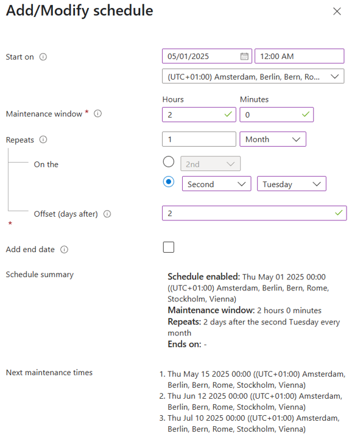

# Azure Update Manager Exercises

## Review Update Status
In this exercise, you will review the update status of your servers in Azure Update Manager.

1. Open the Microsoft Azure Portal.
2. Navigate to **Azure Update Manager**. Use the **Search field** in the top of the Azure portal to quickly find resources and services.
3. In Azure Update Manager, review the **Overview** page. Examine the following information:
    - Update status of machines
    - Update installation status
    - Pending Windows updates
    - Pending Linux updates
4. In Azure Update Manager, click **Manage > Pending updates**.

---

## Configure Maintenance Configuration
In this exercise, you will configure a scheduled update for all Windows machines two days after the second Tuesday of each month.

1. Open the Microsoft Azure Portal.
2. Navigate to **Azure Update Manager** using the **Search field**.
3. In Azure Update Manager, click **Overview**.
4. On the Overview page, click **Schedule updates**.
5. On the **Create a maintenance configuration** page, fill in the following:
    - **Resource Group**: Create a new resource group named `arcbox-MaintConf`.
    - **Configuration name**: `MonthlyUpdate`.
    - **Region**: Use the same region as your ArcBox environment.
    - **Maintenance scope**: Select **Guest including Arc-enabled servers**.
    - **Reboot setting**: Reboot if required.
6. Click **Add a schedule**.
7. On the **Add/Modify schedule** page, configure the schedule as shown in the figure below, then click **Save**. 

8. On the **Create a maintenance configuration** page, click **Next** on the following tabs:
    - **Basic**
    - **Resources**
9. On the **Dynamic Scopes** page:
    - Click **Add a dynamic scope**.
    - On the **Select filter by** page, select a dynamic filter to include all Arc Servers with all OS types. Optionally, use Azure Tags to filter resources. Click **Ok**.
    - Click **Save**.
10. On the **Updates** page, include all updates, then click **Next**.
11. On the **Events** page, skip triggering any events (e.g., scripts) before or after updates, then click **Next**.
12. On the **Tags** page, click **Next**.
13. On the **Review** page, click **Create**.
14. Once the deployment is complete:
     - Navigate to the `arcbox-MaintConf` resource group and review the new resource created for the Maintenance configuration.
     - Navigate to **Azure Update Manager** and review the Maintenance configuration under **Manage > Maintenance configuration**.

You have now configured a Maintenance configuration to update all Arc-enabled servers every month. This configuration includes all updates with a maximum maintenance window of two hours. Since it uses a dynamic scope, all future Arc-enabled servers will also be included.

---

## Deploy Updates
In this exercise, you will run a one-time update for your Windows servers. Before deploying updates, you will check for new updates.

1. Open the Microsoft Azure Portal.
2. Navigate to **Azure Update Manager** using the **Search field**.
3. In Azure Update Manager, click **Check for updates**.
4. In the **Select resource and check for updates** window, filter the view to show only Arc-enabled servers with Windows OS.
5. Select all Arc-enabled servers in the list.
6. Click **Check for updates**.
7. In the Microsoft Azure Portal, under **Notifications**, you will see **Assessment in progress**.
8. Once the assessment is completed:
    - Navigate to **Azure Update Manager > History**.
    - Review the assessment status for each machine.
9. Navigate to the **Azure Update Manager Overview** page.
10. On the Overview page, click **One-time update**.
11. In the **Install updates now** popup, click **Add machines**.
12. On the **Install one-time updates** page:
     - Click **Add machines**.
     - On the **Select resources** page, select all Windows machines, then click **Next**.
     - On the **Updates** page, include all classifications for Windows, then click **Next**.
     - On the **Properties** page, use the default settings, then click **Next**.
     - On the **Review + install** page, review all settings and click **Install**.
13. In the Microsoft Azure Portal, under **Notifications**, verify that you see an **Install updates request submitted**.
14. In Azure Update Manager, click **Manage > History**.
15. On the **History** page:
     - Filter the view to show only **Install updates** operations.
     - Verify that updates are in progress.
16. After a few minutes, confirm that all updates show **Succeeded**.

---

## Reporting
Azure Update Manager includes a set of reports. In this exercise, you will review the default reports.

1. Open the Microsoft Azure Portal.
2. Navigate to **Azure Update Manager** using the **Search field**.
3. In Azure Update Manager, expand **Monitoring** and select **Reports**.
4. Review each tab of the default **Update Compliance Report**.
5. On the **Reports > Update Compliance Report** page, click **Workbooks**.
6. On the **Reports > Gallery** page, open the **Overview workbook**.
7. In the Overview workbook:
    - Select your subscription.
    - Review all information in the workbook.
