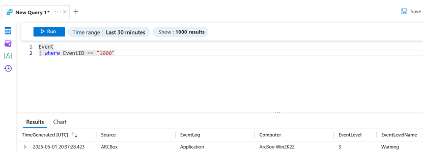

# Monitor

I denna övning kommer vi först att konfigurera Azure Monitor för att samla in händelser från Arc-aktiverade Windows-maskiner. Senare i labben kommer vi att konfigurera en varningsregel för en specifik händelse.

## Data Collection Rule

I Azure Monitor definierar en datainsamlingsregel (DCR) vilken data som ska samlas in, varifrån och vart den ska skickas. En datainsamlingsregel är som en uppsättning instruktioner som talar om för Azure:

- Vilka resurser som ska övervakas (t.ex. virtuella maskiner)
- Vilken data som ska samlas in (t.ex. prestandamått, loggar)
- Vart datan ska skickas (t.ex. Log Analytics, Storage, Event Hub)

Vi kommer att omkonfigurera en befintlig datainsamlingsregel för att också samla in händelser från Applikationsloggen på Windows-servrar.

1. Öppna Microsoft Azure-portalen
2. Navigera till Data Collection Rule. Det snabbaste sättet att hitta resurser och tjänster i Azure-portalen är att använda "Sökfältet" högst upp i portalen.
3. På sidan för Data Collection Rules, klicka på **Create**
4. På sidan Create Data Collection Rule, Basics, fyll i:
    - **Name**: CollectTestEvents
    - **Subscription**: Välj din ARCBox-prenumeration
    - **Resource Group**: Skapa en ny resursgrupp med namnet ARCBox-DCR
    - **Region**: Samma region som de andra ARCBox-resurserna
    - **Platform Type**: Windows
5. På sidan Create Data Collection Rule, Basics, klicka på **Next**
6. På sidan Create Data Collection Rule, Resources, klicka på **Add resources** och välj ARCBox-prenumerationen.
    
7. På sidan Create Data Collection Rule, Resources, klicka på **Next**
8. På sidan Create Data Collection Rule, Collect and deliver, välj **Windows Event Logs** och välj **Application, Warning**. Klicka på **Next**
    
9. På sidan Add Data source, Destination, klicka på **Add destination**
10. Under Destination type, välj Arc Jumpbox Log Analytics workspace
    
11. På sidan Add Data source, Destination, klicka på **Add data source**
12. På sidan Create Data Collection Rule, Collect and deliver, klicka på **Next**
13. På sidan Create Data Collection Rule, Tags, klicka på **Next**
14. På sidan Create Data Collection Rule, Review + Create, klicka på **Create**

Vi har nu konfigurerat datainsamlingsregeln för att samla in händelser med varningsnivå i Applikationsloggen.

## Generera testhändelse

För att generera en testhändelse på en av Windows-servrarna kan vi använda PowerShell.

1. Anslut till ArcBox-Win2K22-servern
2. På ArcBox-Win2K22-servern, starta Windows PowerShell
3. I Windows PowerShell, kör följande kommando för att registrera en ny händelsekälla:

    ```powershell
    New-EventLog -LogName Application -Source ARCBox
    ```

4. I Windows PowerShell, kör följande kommando för att generera en testhändelse:

    ```powershell
    Write-EventLog -LogName "Application" -Source "ARCBox" -EventID 1000 -EntryType Warning -Message "TEST från ARCBox"
    ```

5. På ArcBox-Win2K22-servern, öppna Event Viewer och verifiera att händelsen har skapats.


## Query Logs och skapa en varningsregel

Du kan fråga loggar i Azure Monitor när du behöver analysera, undersöka eller felsöka vad som händer i din miljö. Loggar innehåller detaljerade register över aktivitet, prestanda och problem från dina resurser.

### Vanliga scenarier:

- Diagnostisera problem (t.ex. "Varför kraschade denna VM?")
- Spåra händelser (t.ex. "Vem åtkomstade denna resurs?")
- Övervaka prestanda (t.ex. "Hur trendar CPU-användningen?")
- Skapa varningar eller instrumentpaneler med anpassade loggfrågor

Loggfrågor hjälper dig att omvandla rådata till användbara insikter så att du bättre kan förstå och hantera dina resurser.

1. Öppna Microsoft Azure-portalen
2. Navigera till Azure Monitor
3. I Azure Monitor, klicka på **Logs**
4. I Logs, kör följande fråga

5. Verifiera att du ser testhändelsen som genererades tidigare
6. Nu när vi har en fungerande loggfråga kan vi skapa en varningsregel.
7. I Logs-fönstret, klicka på **New alert rule**

8. På sidan Create an alert rule, scrolla ner och ändra:
    - **Threshold value** till 1
    - **Frequency of evaluation** till 1 minut
9. På sidan Create an alert rule, klicka på **Next**
10. På sidan Create an alert rule, Actions, konfigurera **None action**, klicka på **Next**
11. På sidan Create an alert rule, Details, fyll i:
     - **Subscription**: Välj din ARCBox-prenumeration
     - **Resource Group**: Skapa en ny resursgrupp med namnet ARCBox-Alert
     - **Severity**: Warning
     - **Alert rule name**: ARCBox Alert Rule Event ID 1000
     - **Alert rule description**: Event ID genererad på server.
     - **Region**: Samma region som de andra ARCBox-resurserna
12. På sidan Create an alert rule, Details, klicka på **Next**
13. På sidan Create an alert rule, Tags, klicka på **Next**
14. På sidan Create an alert rule, Review + Create, klicka på **Create**
15. När den nya varningsregeln har skapats, navigera till Azure Monitor och klicka på **Alerts**
16. På sidan Alerts i Azure Monitor, klicka på **Alert Rules** och verifiera att den nya varningsregeln är listad
17. Anslut till ArcBox-Win2K22-servern
18. På ArcBox-Win2K22-servern, starta Windows PowerShell
19. I Windows PowerShell, kör följande kommando för att generera en testhändelse:

     ```powershell
     Write-EventLog -LogName "Application" -Source "ARCBox" -EventID 1000 -EntryType Warning -Message "TEST från ARCBox"
     ```

20. På ArcBox-Win2K22-servern, öppna Event Viewer och verifiera att händelsen har skapats.
21. I Microsoft Azure-portalen, navigera till Monitor och sidan Alerts.
22. Verifiera att du ser en ny varning baserad på händelsen på ArcBox-Win2K22.


I denna övning har du byggt en varningsregel för att generera varningar baserat på en händelse i Applikationsloggen på Windows-servrar.

---

## Insights och Dashboards

### Insights

Insights i Azure Monitor är förbyggda verktyg som ger dig djup insyn i prestanda, hälsa och användning av specifika Azure-tjänster—som virtuella maskiner, containrar, applikationer och mer. Istället för att bygga allt från grunden erbjuder Insights:

- Instrumentpaneler och visualiseringar anpassade för varje tjänst
- Smarta rekommendationer och varningar
- Lättlästa mått och loggar

#### Exempel:

- VM Insights visar CPU, minne, disk och nätverksanvändning för virtuella maskiner.
- Container Insights övervakar Kubernetes-kluster.
- Application Insights spårar app-prestanda och användarbeteende.

Insights gör det snabbare och enklare att övervaka och felsöka utan att behöva komplexa inställningar.

1. Öppna Microsoft Azure-portalen
2. Navigera till Monitor, expandera **Insights**
3. Under Insights, klicka på **Virtual Machines**
4. Under Virtual Machines, klicka på fliken **Performance**
5. Under Virtual Machines, bläddra igenom de olika standardvyerna i Virtual Machines Insights.

### Dashboards

Instrumentpaneler i Azure är anpassningsbara vyer som låter dig visualisera och övervaka dina resurser på ett ställe. Du kan fästa diagram, mått, loggar och mer för att få en snabb översikt över vad som händer i din miljö. Instrumentpaneler hjälper dig:

- Spåra prestanda och hälsa
- Upptäcka problem snabbt
- Dela vyer med ditt team

Instrumentpaneler är interaktiva och kan byggas för att visa exakt vad som är viktigast för dig.

6. Under Virtual Machines, på fliken Performance, välj ett diagram och klicka på **PIN**-ikonen.

7. På fliken Pin to dashboard, välj att skapa en ny privat instrumentpanel med namnet **ARCBox Dashboard**. Klicka på **Create and pin**.
8. I Azure-portalen, navigera till **Dashboards**.


---

## Workbooks

Azure Monitor Workbooks är flexibla, interaktiva rapporter som låter dig visualisera data från mått, loggar och varningar på ett ställe. De hjälper dig att utforska, analysera och dela insikter om dina Azure-resurser. Med Workbooks kan du:

- Kombinera diagram, tabeller, text och filter
- Använda KQL-frågor för att gräva i data
- Skapa anpassade övervakningsvyer för team

De är perfekta för att bygga rika instrumentpaneler och undersökningar utan att skriva kod.

1. Öppna Microsoft Azure-portalen
2. Navigera till Monitor, expandera **Workbooks**
3. Under Workbooks, öppna **Alerts workbook**
4. I Alerts workbook, verifiera att du kan se varningen som genererades i föregående övning.
5. I Alerts workbook, använd funktionen **PIN** för att fästa Alerts-vyn till den instrumentpanel som skapades tidigare.

6. Navigera till Monitor, expandera **Workbooks**
7. Bläddra igenom de olika Workbooks.

---

## Dependency Mapper

Dependency Mapper är en funktion i VM Insights som visar hur dina virtuella maskiner och processer ansluter och interagerar med varandra. Det hjälper dig:

- Visualisera anslutningar mellan VMs, portar och processer
- Förstå applikationsberoenden
- Felsöka nätverks- eller prestandaproblem

Denna karta ger en tydlig bild av din systemarkitektur, vilket gör det enklare att hantera och optimera din miljö.

### Steg:

1. Öppna Microsoft Azure-portalen
2. Navigera till Monitor, expandera **Insights** och klicka på **Virtual Machines**
3. På sidan Map, klicka på **Enable**
4. På fliken Monitoring configuration, klicka på **Edit**
5. På fliken Monitoring configuration, klicka på **Create New**
6. På fliken Create new rule, fyll i följande information:
    - **Data collection rule name**: MapDataCollection
    - **Enable process and dependencies (Map)**: Markera kryssrutan
    - **Subscription**: Välj din ARCBox-prenumeration
    - **Log Analytics workspace**: Välj din Jumpstart Log Analytic workspace
7. På fliken Create new rule, klicka på **Create**

8. På fliken Monitoring configuration, klicka på **Configure**
9. I Microsoft Azure-portalen, under Notifications, verifiera att du ser **Deployment in progress**-händelsen. Vänta tills distributionen är klar.
10. För att aktivera Dependency Map på alla dina servrar, navigera till **Data Collection Rule** och klicka på **MSVMI-MapDataCollection** datainsamlingsregel.

    - MSVMI står för Microsoft och VM Insights:
      - MS = Microsoft
      - VMI = VM Insights

11. På MSVMI-MapDataCollection datainsamlingsregel, klicka på **Resources** och **Lägg till alla dina Jumpstart-servrar**. När servrar läggs till installeras DependencyAgent-tillägget på servern. Klicka på **Refresh** för att verifiera att alla servrar är listade som resurser på datainsamlingsregeln.
12. Det kan ta "några minuter" innan process- och anslutningsdata samlas in. Detta kan vara ett bra tillfälle att fylla på kaffekoppen.
13. För att visualisera processer och beroenden, navigera till Monitor, expandera **Insights** och klicka på **Virtual Machines**
14. På sidan Virtual Machine, klicka på **Map**
15. Granska standardvyn, välj en av dina Jumpstart-servrar, till exempel ArcBox-Win2K22.

16. På sidan Map, höger sida, välj **Connections**, klicka sedan på **Connection details**
17. På sidan Connections, granska den insamlade datan. Notera att det finns en **PIN to dashboard**-funktion även på denna vy.


### Utmaning:

Logga in på en av Windows-servrarna i Hyper-V, generera nätverkstrafik och använd vyerna Connections och Map för att granska den genererade trafiken.

---

## Change Tracking och Inventory

### Aktivera Change Tracking och Inventory

1. Öppna Microsoft Azure-portalen
2. Navigera till **Change Tracking and Inventory Center**. Det snabbaste sättet att hitta resurser och tjänster i Azure-portalen är att använda "Sökfältet" högst upp i portalen.
3. På sidan Change Tracking and Inventory Center, Machines, välj alla Jumpstart-maskiner och klicka på **Enable Change Tracking & Inventory**
4. På sidan Enable Change Tracking, välj alla maskiner och klicka på **Enable**
5. Det kommer att ta "några minuter" innan alla maskiner börjar rapportera inventeringsdata.
6. När data har samlats in, bläddra igenom vyerna i Change Tracking and Inventory Center för att se vilken data som samlas in som standard.
7. I Change Tracking and Inventory Center, klicka på **Inventory** och sedan **Settings**

### Utmaning:

Utforska Windows File-funktionen för att övervaka ändringar i en specifik fil, till exempel alla filer i mappen `C:\LABFILES\` på alla Windows-maskiner. Monitor

In this exercise we will first configure Azure Monitor to collect events from Arc-enabled Windows machines. We will later in the lab configure an alert rule for the specific event.


## Data Collection Rule (English)

In Azure Monitor, a data collection rule (DCR) defines what data to collect, from where, and where to send it. A data collection rule is like a set of instructions that tells Azure:

- Which resources to watch (e.g. virtual machines)
- What data to collect (e.g. performance metrics, logs)
- Where to send the data (e.g. Log Analytics, Storage, Event Hub)

We will re-configure an existing data collection rule to also collect events from the Application log on Windows servers.

1. Open the Microsoft Azure Portal
2. Navigate to Data Collection rule. Quickest way to find resources and services in the Azure Portal is to use the “Search field” in the top of the Azure portal
3. On the Data Collection Rules page, click **Create**
4. On the Create Data Collection Rule page, Basics, input:
    - **Name**: CollectTestEvents
    - **Subscription**: Choose your ARCBox subscription
    - **Resource Group**: Create a new resource group named ARCBox-DCR
    - **Region**: Same region as the other ARCBox resources
    - **Platform Type**: Windows
5. On the Create Data Collection Rule page, Basics, click **Next**
6. On the Create Data Collection Rule page, Resources, click **Add resources** and select the ARCBox subscription.
    
7. On the Create Data Collection Rule page, Resources, click **Next**
8. On the Create Data Collection Rule page, Collect and deliver, select **Windows Event Logs** and select **Application, Warning**. Click **Next**
    
9. On the Add Data source, Destination, click **Add destination**
10. Under Destination type, select the Arc Jumpbox Log Analytics workspace
    
11. On the Add Data source, Destination, click **Add data source**
12. On the Create Data Collection Rule page, Collect and deliver, click **Next**
13. On the Create Data Collection Rule page, Tags, click **Next**
14. On the Create Data Collection Rule page, Review + Create, click **Create**

We have now configured the Data collection rule to collect events with Warning severity in the Application log.

## Generate test event

To generate a test event on one of the Windows servers we can use PowerShell.

1. Connect to the ArcBox-Win2K22 server
2. On the ArcBox-Win2K22 server, start Windows PowerShell
3. In Windows PowerShell, run the following command to register a new event source:

    ```powershell
    New-EventLog -LogName Application -Source ARCBox
    ```

4. In Windows PowerShell, run the following command to generate a test event:

    ```powershell
    Write-EventLog -LogName "Application" -Source "ARCBox" -EventID 1000 -EntryType Warning -Message "TEST from ARCBox"
    ```

5. On the ArcBox-Win2K22 server, open Event Viewer and verify that the event is created.


## Query Logs and create an alert rule

You can query logs in Azure Monitor when you need to analyse, investigate, or troubleshoot what's happening in your environment. Logs contain detailed records of activity, performance, and issues from your resources.

### Common Scenarios:

- Diagnosing issues (e.g. "Why did this VM crash?")
- Tracking events (e.g. "Who accessed this resource?")
- Monitoring performance (e.g. "How is CPU usage trending?")
- Creating alerts or dashboards using custom log queries

Log queries help you turn raw data into useful insights so you can understand and manage your resources better.

1. Open the Microsoft Azure Portal
2. Navigate to Azure Monitor
3. In Azure Monitor, click **Logs**
4. In Logs, run the following query

5. Verify that you see the test event generated earlier
6. Now when we have a working log query, we can create an alert rule.
7. In the Logs window, click **New alert rule**

8. On the Create an alert rule page, scroll down and change:
    - **Threshold value** to 1
    - **Frequency of evaluation** to 1 minute
9. On the Create an alert rule page, click **Next**
10. On the Create an alert rule, Actions page, configure **None action**, click **Next**
11. On the Create an alert rule, Details page, fill in:
     - **Subscription**: Choose your ARCBox subscription
     - **Resource Group**: Create a new resource group named ARCBox-Alert
     - **Severity**: Warning
     - **Alert rule name**: ARCBox Alert Rule Event ID 1000
     - **Alert rule description**: Event ID generated on server.
     - **Region**: Same region as the other ARCBox resources
12. On the Create an alert rule, Details page, click **Next**
13. On the Create an alert rule, Tags page, click **Next**
14. On the Create an alert rule, Review + Create page, click **Create**
15. Once the new alert rule is created, navigate to Azure Monitor and click **Alerts**
16. In Azure Monitor, Alerts page, click **Alert Rules** and verify the new alert rule is listed
17. Connect to the ArcBox-Win2K22 server
18. On the ArcBox-Win2K22 server, start Windows PowerShell
19. In Windows PowerShell, run the following command to generate a test event:

     ```powershell
     Write-EventLog -LogName "Application" -Source "ARCBox" -EventID 1000 -EntryType Warning -Message "TEST from ARCBox"
     ```

20. On the ArcBox-Win2K22 server, open Event Viewer and verify that the event is created.
21. In the Microsoft Azure portal, navigate to Monitor and the Alerts page.
22. Verify that you see a new alert based on the event on ArcBox-Win2K22.


In this exercise you have built an alert rule to generate alerts based on an event in the Application log of Windows servers.

---

## Insights and Dashboards

### Insights

Insights in Azure Monitor are pre-built tools that give you deep visibility into the performance, health, and usage of specific Azure services—like virtual machines, containers, applications, and more. Instead of building everything from scratch, Insights provide:

- Dashboards and visualizations tailored to each service
- Smart recommendations and alerts
- Easy-to-read metrics and logs

#### Examples:

- VM Insights shows CPU, memory, disk, and network usage for virtual machines.
- Container Insights monitors Kubernetes clusters.
- Application Insights tracks app performance and user behaviour.

Insights make it faster and easier to monitor and troubleshoot without needing complex setup.

1. Open the Microsoft Azure Portal
2. Navigate to Monitor, expand **Insights**
3. Under Insights, click **Virtual Machines**
4. Under Virtual Machines, click the **Performance** tab
5. Under Virtual Machines, browse through the different default views in Virtual Machines Insights.

### Dashboards

Dashboards in Azure are customizable views that let you visualize and monitor your resources in one place. You can pin charts, metrics, logs, and more to get a quick overview of what's happening in your environment. Dashboards help you:

- Track performance and health
- Spot issues quickly
- Share views with your team

Dashboards are interactive and can be built to show exactly what matters most to you.

6. Under Virtual Machines, on the Performance tab, select one graph and click the **PIN** icon.

7. On the Pin to dashboard tab, choose to create a new private dashboard named **ARCBox Dashboard**. Click **Create and pin**.
8. In the Azure Portal, navigate to **Dashboards**.


---

## Workbooks

Azure Monitor Workbooks are flexible, interactive reports that let you visualize data from metrics, logs, and alerts in one place. They help you explore, analyse, and share insights about your Azure resources. With Workbooks, you can:

- Combine charts, tables, text, and filters
- Use KQL queries to dig into data
- Create custom monitoring views for teams

They’re perfect for building rich dashboards and investigations without writing code.

1. Open the Microsoft Azure Portal
2. Navigate to Monitor, expand **Workbooks**
3. Under Workbooks, open the **Alerts workbook**
4. In the Alerts workbook, verify that you can see the alert generated in the previous exercise.
5. In the Alerts workbook, use the **PIN** function to pin the Alerts view to the Dashboard created earlier.

6. Navigate to Monitor, expand **Workbooks**
7. Browse the different Workbooks.

---

## Dependency Mapper

Dependency Mapper is a feature in VM Insights that shows how your virtual machines and processes connect and interact with each other. It helps you:

- Visualize connections between VMs, ports, and processes
- Understand application dependencies
- Troubleshoot network or performance issues

This map gives a clear view of your system architecture, making it easier to manage and optimize your environment.

### Steps:

1. Open the Microsoft Azure Portal
2. Navigate to Monitor, expand **Insights** and click **Virtual Machines**
3. On the Map page, click **Enable**
4. On the Monitoring configuration tab, click **Edit**
5. On the Monitoring configuration tab, click **Create New**
6. On the Create new rule tab, input the following information:
    - **Data collection rule name**: MapDataCollection
    - **Enable process and dependencies (Map)**: Check checkbox
    - **Subscription**: Choose your ARCBox subscription
    - **Log Analytics workspace**: Select your Jumpstart Log Analytic workspace
7. On the Create new rule tab, click **Create**

8. On the Monitoring configuration tab, click **Configure**
9. In the Microsoft Azure Portal, under Notifications, verify that you see **Deployment in progress** event. Wait until the deployment is completed.
10. To enable Dependency Map on all your servers, navigate to **Data Collection Rule** and click the **MSVMI-MapDataCollection** data collection rule.

    - MSVMI stands for Microsoft and VM Insights:
      - MS = Microsoft
      - VMI = VM Insights

11. On the MSVMI-MapDataCollection data collection rule, click **Resources** and **Add all your Jumpstart servers**. When adding servers, the DependencyAgent extension is installed on the server. Click **Refresh** to verify that all servers are listed as resources on the data collection rule.
12. It can take “a couple of minutes” before process and connection data is collected. This might be a good opportunity to refill your coffee.
13. To visualize process and dependencies navigate to Monitor, expand **Insights** and click **Virtual Machines**
14. On the Virtual Machine page, click **Map**
15. Review the standard view, select one of your Jumpstart servers, for example ArcBox-Win2K22.

16. On the Map page, right side, select **Connections**, then click **Connection details**
17. On the Connections page, review the collected data. Note there is a **PIN to dashboard** option on this view too.


### Challenge:

Log on to one of the Windows servers in Hyper-V, generate network traffic and use the Connections and Map views to review the traffic generated.

---

## Change Tracking and Inventory

### Enable Change Tracking and Inventory

1. Open the Microsoft Azure Portal
2. Navigate to **Change Tracking and Inventory Center**. Quickest way to find resources and services in the Azure Portal is to use the “Search field” in the top of the Azure portal.
3. On the Change Tracking and Inventory Center page, Machines, select all Jumpstart machines and click **Enable Change Tracking & Inventory**
4. On the Enable Change Tracking page, select all machines and click **Enable**
5. It will take “a couple of minutes” before all machines start reporting inventory data.
6. Once data has been collected, browse views in Change Tracking and Inventory Center to see what data is collected by default.
7. In Change Tracking and Inventory Center, click **Inventory** and then **Settings**

### Challenge:

Explore the Windows File feature to monitor changes in a specific file, for example all files in folder `C:\LABFILES\` on all Windows machines.
