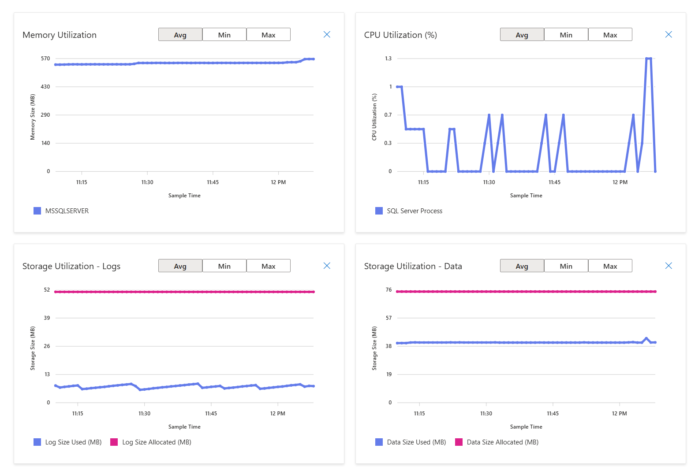

# SQL

Dags att gå in i lite djupare detaljer och titta närmare på data om SQL Server och SQL databaser. När SQL Server är ARC enabled kommer vi åt dessa resurser genom portalen, precis som om dom låg i Azure.

Denna demo är baserad på [Azure Arc Jumpstart - DataOps](https://jumpstart.azure.com/azure_jumpstart_arcbox/DataOps).

Steg:
* Sök upp Azure Arc i portalen, gå till SQL server instances . Öppna upp instansen.
* Kör Best practice analysis och utvärdera några av rekommendationerna 
* Öppna fliken Defender for cloud för din SQL Server - vad finns det för Rekommendationer, varningar och Vulnerability assessment findings?  
* Öppna fliken Databases och inspektera vilka databaser som finns 
* Öppna fliken Backups och konfigurera backuperna för en av databaserna 
* Öppna fliken Performance dashboard - kräver SQL Server standard/Enterprise.  
