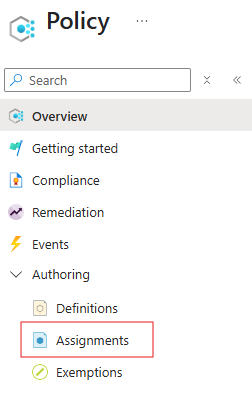
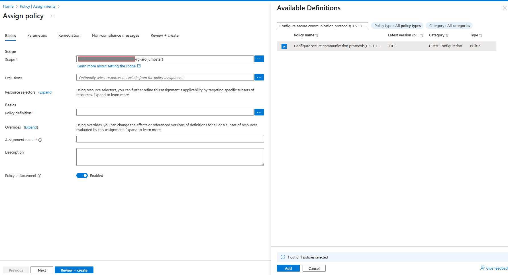
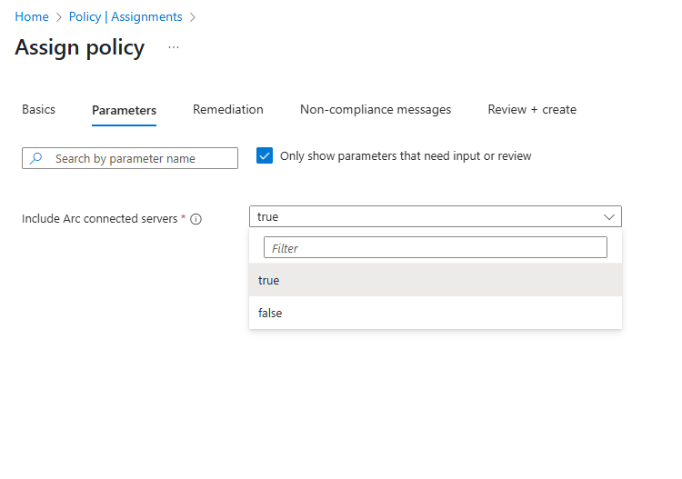
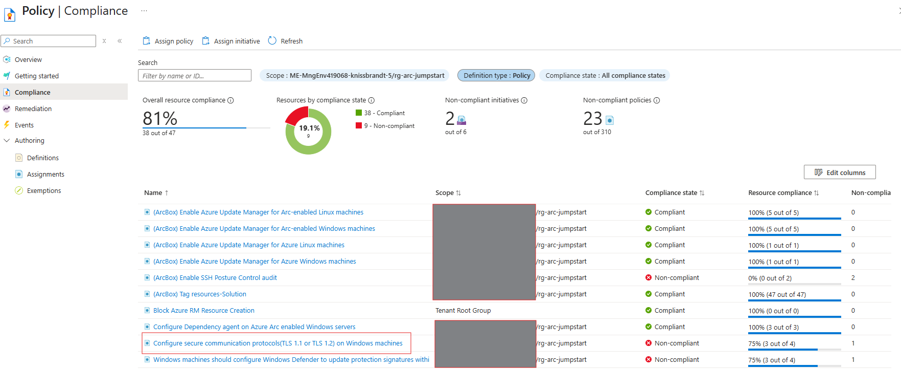
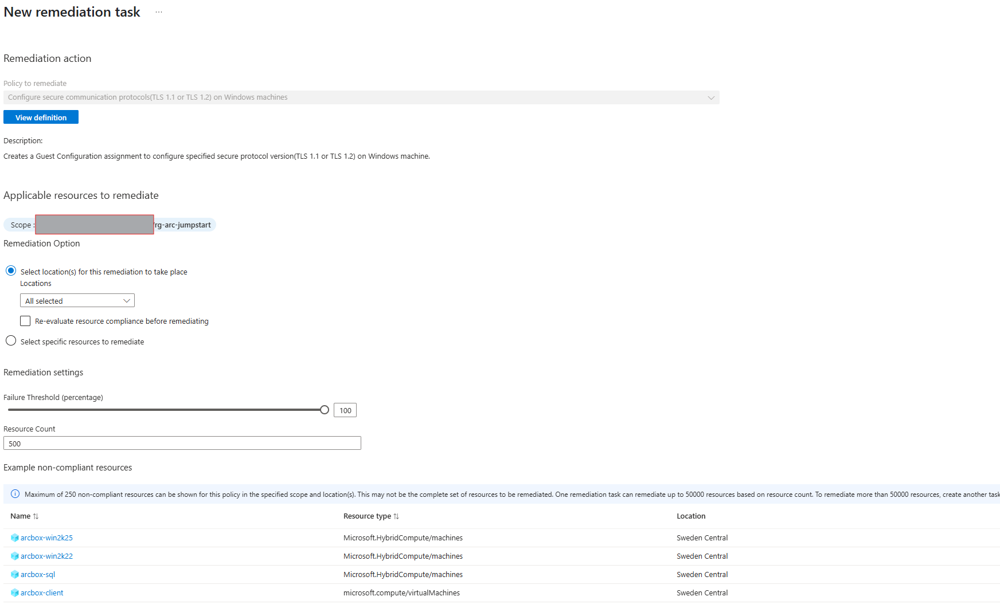

# Skapa Azure Policy Assignment och remediera för Arc maskiner

I denna del kommer vi att använda en built-in Azure Policy sätta ett krav på minimum TLS 1.2 på våra Windows Azure Arc maskiner. 

## Introduktion
Azure Policy är en tjänst i Azure som gör det möjligt att skapa, tillämpa och hantera policyer för resurser i Azure. Med Azure Policy kan du säkerställa att dina resurser följer organisationens standarder och regler. 

Azure Policy är strukturerad i ett antal huvudkomponenter:
1. **Policy Definitions**: En policydefinition beskriver vad som ska göras med resurser som inte följer policyn. Det kan vara att auditera, tillämpa eller blockera resurser. De kan vara custom eller inbyggda.
2. **Policy Assignments**: En policytilldelning är en instans av en policydefinition som tillämpas på ett specifikt scope (Managmentgrupp, subscription eller resursgrupp). 
3. **Policy Remediation**: En policyåtgärd är en åtgärd som vidtas för att åtgärda resurser som inte följer policyn. För kunna köra remediation måste policyn stödja remediation. I vårt fall kommer vi att använda en inbyggd policy som har "deployIfNotExists".

## Skapa en Azure Policy Assignment för att sätta TLS 1.2 på Azure Arc maskiner

För att skapa en Azure Policy Assigment för att sätta minimum TLS 1.2 på våra Windows Azure Arc maskiner, följ dessa steg:
1. Gå till Azure-portalen och sök efter "Policy".
2. Klicka på Assignments i menyn till vänster.

3. Klicka på "+ Assign policy" för att skapa en ny policytilldelning.
4. Sätt scope till din resursgrupp där dina Azure Arc maskiner finns. Du kan också välja att sätta policyn på hela subscription eller management group.
5. Under "Policy definition", sök efter "Configure secure communication protocols(TLS 1.1 or TLS 1.2) on Windows machines". Välj den inbyggda policyn som matchar detta namn.

6. Gå vidare till "Parameters" och sätt "Include Arc enabled machines" till "true". Detta kommer att säkerställa att policyn inkluderar våra Azure Arc maskiner.

7. Klicka på Review + Create. Detta kommer att skapa en policytilldelning som kommer att tillämpas på de valda scopet. Det kan ta mellan 5-10 minuter innan policyn tillämpas på resurserna.

## Remediera Azure Arc maskiner med TLS 1.2

Denna policyn kommer att auditera om minimum TLS version är 1.2 på våra Azure Arc maskiner. Om den inte är det kommer den att markera dessa resurser som "non-compliant". För att åtgärda detta kan vi använda Azure Policy Remediation för att åtgärda dessa resurser automatiskt.

1. Gå tillbaka till Azure Policy och klicka på "Compliance" i menyn till vänster.
2. Du kommer att se en lista över resurser som inte följer policyn. Klicka på den policytilldelning som du just har skapat.

3. För att åtgärda dessa resurser, klicka på "Create remediation task".

4. Välj de resurser som du vill åtgärda och klicka på "Create". Detta kommer att skapa en remediation task som kommer att deploya SetSecureProtocol configuration till de Windows Azure Arc maskinerna som inte följer policyn. 
5. Du kan övervaka statusen för remediation tasken genom att gå tillbaka till "Remediation tasks" i Azure Policy. Det kan ta mellan 5-10 minuter innan åtgärden är klar.