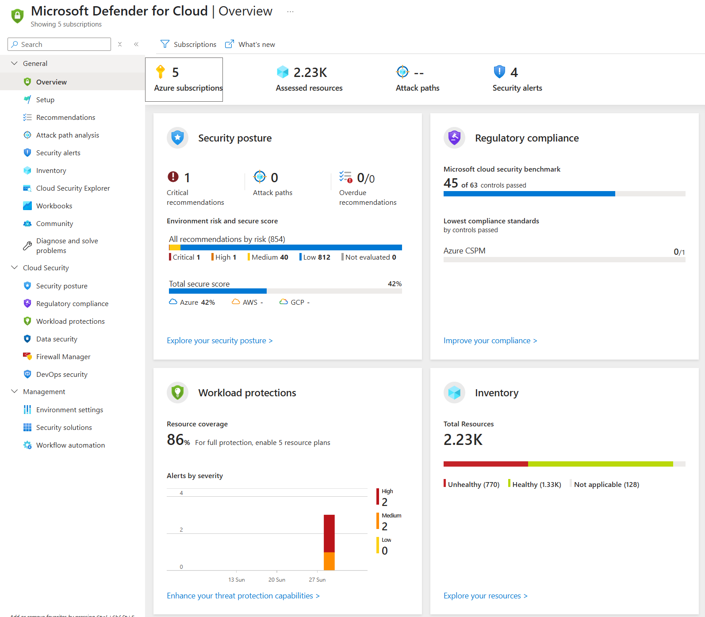

# Defender for cloud

Defender for cloud är plattformen för säkerhet för Azure, AWS, GCP och även ARC-enablade tjänster och servrar.

* Sidan Overview ger en översikt över miljön. Här finns en samling av information som kan användas som en övergripande dashboard.

* Öppna sidan Recommendations. Här finns en sammanställning av alla rekommendationer som Defender for cloud samlat upp kring konfiguration av din miljö.

* Öppna sidan Security Alerts. Den här sidan innehåller alla Alerts som Defender for cloud samlat upp. Detta kan vara exempelvis vara intrångsförsök eller malware. 

* Öppna Inventory och inspektera vad som finns där. Notera att Azure-resurser och ARC-resurser samlas i samma lista. Klicka in på någon av resurserna för att se vilka Rekommendationer och varningar som finns för just den resursen. 
